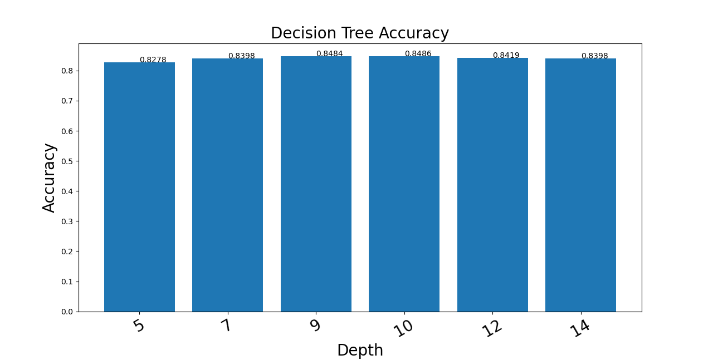
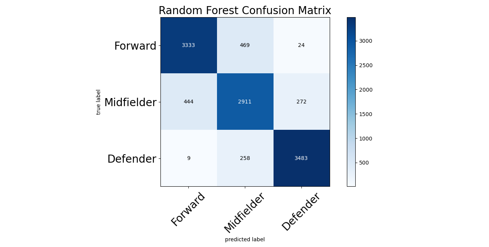

# SOEN_471_Project

## Abstract
This project is a dataset analysis on statistics related to football. More specifically, this dataset contains statistics on over 18 000 players such as dribbling, passing, shooting, defending, and stamina from data collected by sofifa.com. The data collected are stats spanning from the 2015 to 2021 season. The objective of this project is to apply supervised classification techniques to classify player's position based on their statistics and predict which positions they are most likely to play in. Some of the possible positions for players are goalkeeper, defender, midfielder and attacker.

https://www.kaggle.com/stefanoleone992/fifa-21-complete-player-dataset

***

## Introduction
Football is one of the biggest entertainments in the world. With more than 18 000 professional players across the world, it has become very hard to find players that could be a fit in a football club. As a fanatic of football, we pick an Interest of player's performance on certain position. Players tend to perform better in certain position than others.  There are many positions in football such as full-back, centre-back, sweeper, goalkeeper, wing-back, defensive-midfield, central-midfield, attacking-midfield, forward, winger and striker. All those positions have their effect on the game. Assembling a team with different position is essential to make a more fluid gameplay and bring out the best experience for the players. There are multiple factors that might affect the game such as player’s experience, formations, strategies etc. However, for the scope of this project, we will solely focus on positions.

The main objective is to use the player’s stats from 2015 to 2021 to predict potential player's position based on trained stats. This will allow potential coaches or football adept to use players in their best position.

The current problem is coaches have difficult time to pick players based on their abilities. Often, they would put players in their unpreferred position because no one can fill those holes. During transfer session, it is often hard to find an adequate player to buy because of the uncertainty of their preferred position. Thus, this project is intended to solve the problem of future player based on previous trained models. It will predict if the player is fit for a certain position or not. 

There are a few studies using machine learning algorithms to predict game potential outcome such as “A Machine Learning framework for sport result prediction”. They analyzed different model of ML focusing on ANN (Artificial Neural Network) to predict sport results. Another study made by Hengzhi Chen “Neural Network Algorithm in Predicting Football Match Outcome Based on Player Ability Index” is based on player abilities to affect a football game. It will predict the outcome of the game based on player’s abilities. Plenty of previous studies showed that neural network is crucial for predictions in sports. 

***

## Materials and Methods
The dataset that is chosen for this project includes all the player statistics for all the players from the popular soccer game Fifa. Those statistics include skills such as shooting, passing, dribbling, defending, and much more. In fact, the dataset contains about 100 columns for each player. A very interesting aspect of this dataset is that it is updated every year when a new Fifa game comes out and therefore the dataset includes player statistics from each Fifa game since the collection began with Fifa 15. Moreover, instead of appending new data to the existing dataset, each Fifa game has its own csv file containing the statistics from that year only, meaning we have data pertaining to Fifa 15, 16, 17 and on until Fifa 21, all in separate files. This is something that will facilitate for us to test on individual sets if we wish. Therefore, we can train on individual sets and compare those models with models trained on all the sets combined. Last thing to note about the chosen dataset is that some cleaning and feature engineering will be applied to it. Given the large number of features in the dataset as mentioned earlier, it is clear that some features give us irrelevant information about a player when the goal is to decide their position on the pitch. Therefore, the dataset will be optimized as much as possible before using it to train our models.

Multiple techniques will be used to achieve the objective. The algorithms that will be used to train our models are decision trees, random forest, and kNN (K-nearest neighbors). Decision tree is an algorithm where at each node we split our training set using the feature that gives us the best information gain. For example, when dealing with instances of two classes, we want instances from one class on one side of the split, and instances from another class on the other side, and so we choose the feature that splits these instances best. Random forests are multiple trees where some randomness is introduced so that we end up with a collection of trees that could predict an outcome. These trees then can “vote” for a class and the predicted class will be the one that is chosen by the most number of trees. KNN algorithm, on the other hand, classifies instances by grouping it with neighbors that it has the most in common with. For each algorithm, the hyperparameters will be tuned to find the most optimal model. For example, we will compare the different results obtained by decision tree model by changing the splitting criterion (gini vs. entropy), before comparing our decision tree model with the KNN model. Moreover, another technique that we are interested in is the naïve bayes classifier, which is not seen in this course. Naïve bayes algorithm classifies an instance by calculating a score for each possible class that the instance can belong to and chooses the class with the highest score. We expect all four of these models to have positives and negatives when faced with a dataset like ours. For example, we know that there are some very discriminative features, such as shooting skills, which differentiates strikers from the rest of the players, and therefore decision trees might give accurate classifications. KNN on the other hand might be useful since we know that players of the same position have a few attributes in common which they excel in. Therefore, it will be interesting to analyze each model carefully and determine what makes one model better than the others for our dataset.

Finally, most of our work will be done using Apache Spark and our data will be stored in a spark dataframe. While PyCharm will be our main IDE, Jupyter Notebook will also be used to help visualize our results better.

***

## Results
### Data Preparation

Before we delve into the results of our models, let us go over the data preparation that was required of our dataset.
First of all, as opposed to what was presented during our presentation, our final results came from training our models on the whole dataset from Fifa 15 to Fifa 21, instead of testing only on the Fifa 21 dataset (19,000 entries). Therefore, our dataset containing statistics from Fifa 15 to Fifa 21 consisted of 122,841 entries. A sample of the original dataset can be seen below:

|sofifa_id|          player_url|       short_name|           long_name|age|       dob|height_cm|weight_kg|nationality|          club_name|         league_name|league_rank|overall|potential|value_eur|wage_eur|player_positions|preferred_foot|international_reputation|weak_foot|
|---------|--------------------|-----------------|--------------------|---|----------|---------|---------|-----------|-------------------|--------------------|-----------|-------|---------|---------|--------|----------------|--------------|------------------------|---------|
|   158023|https://sofifa.co...|         L. Messi|Lionel Andrés Mes...| 33|1987-06-24|      170|       72|  Argentina|       FC Barcelona|Spain Primera Div...|          1|     93|       93| 67500000|  560000|      RW, ST, CF|          Left|                       5|        4|
|    20801|https://sofifa.co...|Cristiano Ronaldo|Cristiano Ronaldo...| 35|1985-02-05|      187|       83|   Portugal|           Juventus|     Italian Serie A|          1|     92|       92| 46000000|  220000|          ST, LW|         Right|                       5|        4|
|   200389|https://sofifa.co...|         J. Oblak|           Jan Oblak| 27|1993-01-07|      188|       87|   Slovenia|    Atlético Madrid|Spain Primera Div...|          1|     91|       93| 75000000|  125000|              GK|         Right|                       3|        3|
|   188545|https://sofifa.co...|   R. Lewandowski|  Robert Lewandowski| 31|1988-08-21|      184|       80|     Poland|  FC Bayern München|German 1. Bundesliga|          1|     91|       91| 80000000|  240000|              ST|         Right|                       4|        4|
|   190871|https://sofifa.co...|        Neymar Jr|Neymar da Silva S...| 28|1992-02-05|      175|       68|     Brazil|Paris Saint-Germain|      French Ligue 1|          1|     91|       91| 90000000|  270000|         LW, CAM|         Right|                       5|        5|

Then, from the original dataset, we had to cut down a large chunk of the features for various reasons. Even though we only see a handful of them here, the total number of features amounted to 106, which is a lot of information for one player. For example, we had to cut down many columns because they were identification features for the players, such as 'short_name', 'long_name', 'age', 'dob' (date of birth), 'nationality', 'club_name', 'sofifa_id' (website from which data was extracted), etc. All these are information that don’t tell us anything about a player’s position, therefore we deemed them safe to be removed.

Furthermore, we had to remove all goalkeepers from the dataset due to the fact that many features were goalkeeper specific. To elaborate, many features in the dataset only had values that made sense for goalkeepers, such as ‘gk_speed’, ‘gk_positioning’, and ‘gk_diving’, amongst other things. These features only had values for players that were classified as ‘goalkeepers’, and had null values for forwards, midfielders, and defenders. Therefore, we decided to remove goalkeepers completely and only train our models to predict the other positions.

We also noticed that about 60% of our data were players that were unfortunately classified either as a substitute or as a reserve. Essentially, these players would play as forward, midfielder, or defender but were not classified accordingly, and therefore we had to drop them from our dataset, which left us with about 40% of the original data, which at this point still accounted for about 44,300 entries.

We then had to normalize the ratings of each player as the players’ overall ratings ranged from 94 (Lionel Messi’s overall rating) to about 47. The problems arise from the fact that Messi and the 47-rated player could both be classified as forwards, but whereas Messi’s attacking skills are all around 90, the other player’s ratings would be much lower, and therefore it would be hard to draw the same conclusion (both being forwards) from these two ratings. Therefore, we have divided all the attributes of each player by their overall score so we could evaluate them on the same scale and their attributes would be in relation to their overall score. After this process we removed the overall score feature as well as that did not tell us anything about a player’s field position.

Finally, the features were all cleaned up but one last problem remained which was the fact that the data set was imbalanced. At this point there were 7,990 forwards, 18,551 midfielders, and 17,768 defenders. Even though midfielders and defenders were represented somewhat equally, they were both represented more than twice as much as forwards. Therefore, we decided to oversample the minority class using a technique called SMOTE. The logic of SMOTE is that it will create lines between a pair of points in the minority class, which is the forwards class in our case, and then create new data points from points that fall in these lines. The new points will then resemble pre-existing data points from the minority class. The result of applying SMOTE to our dataset is shown below:

Before SMOTE:

   Figure 1. Class representation before SMOTE

After SMOTE:

   Figure 2. Class representation after SMOTE

Our final dataset contains a total of 55,653 entries with 21 features as seen in the sample shown below:

|       skill_moves|          shooting|           passing|         dribbling|        defending|attacking_crossing|attacking_finishing|attacking_heading_accuracy|attacking_short_passing|attacking_volleys|   skill_dribbling|skill_fk_accuracy|skill_long_passing| movement_agility|  power_shot_power|mentality_interceptions|mentality_positioning|  mentality_vision|mentality_penalties|defending_standing_tackle|defending_sliding_tackle|team_position|
|------------------|------------------|------------------|------------------|-----------------|------------------|-------------------|--------------------------|-----------------------|-----------------|------------------|-----------------|------------------|-----------------|------------------|-----------------------|---------------------|------------------|-------------------|-------------------------|------------------------|-------------|
| 4.301075268817205|  98.9247311827957| 97.84946236559139|102.15053763440861|40.86021505376344| 91.39784946236558| 102.15053763440861|         75.26881720430107|      97.84946236559139| 94.6236559139785| 103.2258064516129|101.0752688172043| 97.84946236559139|97.84946236559139| 92.47311827956989|      43.01075268817204|                100.0|102.15053763440861|  80.64516129032258|       37.634408602150536|      25.806451612903224|      Forward|
| 5.434782608695652|101.08695652173914| 88.04347826086956| 96.73913043478261|38.04347826086957| 91.30434782608695| 103.26086956521738|         97.82608695652173|      89.13043478260869|93.47826086956522| 95.65217391304348| 82.6086956521739| 83.69565217391305|94.56521739130434|102.17391304347827|     31.521739130434785|   103.26086956521738| 89.13043478260869|  91.30434782608695|        34.78260869565217|       26.08695652173913|      Forward|
| 4.395604395604396|             100.0| 85.71428571428571|  93.4065934065934|47.25274725274725| 78.02197802197803| 103.29670329670331|          93.4065934065934|       92.3076923076923| 97.8021978021978|  93.4065934065934| 93.4065934065934| 76.92307692307693|84.61538461538461|  97.8021978021978|      53.84615384615385|   103.29670329670331| 86.81318681318682|   96.7032967032967|        46.15384615384615|       20.87912087912088|      Forward|
|5.4945054945054945|  93.4065934065934|  94.5054945054945|103.29670329670331|39.56043956043956|  93.4065934065934|   95.6043956043956|         68.13186813186813|       95.6043956043956| 95.6043956043956|104.39560439560441| 97.8021978021978| 89.01098901098901|105.4945054945055| 87.91208791208791|      39.56043956043956|     95.6043956043956|  98.9010989010989|  101.0989010989011|       32.967032967032964|      31.868131868131865|      Forward|
| 4.395604395604396|  94.5054945054945|102.19780219780219|  96.7032967032967|70.32967032967034|103.29670329670331|  90.10989010989012|         60.43956043956044|     103.29670329670331|90.10989010989012|  96.7032967032967|91.20879120879121|102.19780219780219|85.71428571428571|             100.0|      72.52747252747253|     96.7032967032967|103.29670329670331|   92.3076923076923|        71.42857142857143|       58.24175824175825|   Midfielder|

### Decision Tree

To obtain the following results (for all models), our dataset was split 80:20 while using a seed so that we could duplicate the split for the different algorithms.

Our decision tree was trained using entropy and was tested on various maxDepth values.

   Figure 3. Decision Tree Accuracy

This is the confusion matrix corresponding to our most accurate decision tree:

   Figure 4. Best Decision Tree Confusion Matrix

Out of 6 trials, the average accuracy was found to be 84.11%, with the minimum being 82.78% and maximum of 84.86% which had a maximum depth of 10. It was not so surprising to see that there isn’t much variation in terms of accuracy across the different maximum depths as we expect a handful of features to be very discriminative, such as ‘shooting’, ‘defending’ and ‘passing’, with the rest having less information gain, and perhaps even contributing to some overfitting.

In the confusion matrix, we saw a pattern that we expected to see. While many forwards were classified correctly, most of those that weren’t classified correctly were classified as midfielders, with only a few classified as defenders. Similarly, most of misclassified defenders were incorrectly classified as midfielders instead of forwards. When it comes to midfielders however, it seems that the misclassifications have spilled into either side. This makes sense when imagining a soccer pitch with forwards on one side and defenders playing on the opposite side, with little overlapping happening between them. For midfielders, however, there are those who are considered to be defensive midfielders and others that are attacking midfielders, meaning midfielders have a lot in common with both forwards and defenders.

### Random Forest

Our random forests were implemented with varying number of trees. We have decided to use entropy again and, as a maximum depth of 10 yielded our best decision tree, we have used a maximum depth of 10 for all of our random forests as well.

   Figure 5. Random Forest Accuracy

This is the confusion matrix corresponding to our most accurate random forest:

   Figure 6. Best Random Forest Confusion Matrix

Our random forests have an average accuracy of 86.62%, with the minimum being 86.16% and maximum being 86.75%. Overall, changing the number of trees in our random forests seemed to have little effect on the outcome. However, with a best score of 86.75% (for two random forests), we were impressed with the results.

The confusion matrix has the same relative correlations as the decision tree with the same trends that we were expecting to see.

### Naïve Bayes

We have decided to test our naïve bayes algorithm with a smoothing of 1.0. We have not varied the smoothing as our dataset had no null or 0 values.

   Figure 7. Naive Bayes Accuracy

   Figure 8. Naive Bayes Confusion Matrix

As we have decided to not vary the smoothing parameter, we only tested our naïve bayes once, which yielded an accuracy of 76.85%.

### K Nearest Neighbors

We have tested our kNN algorithm with varying number of neighbors.

   Figure 9. k Nearest Neighbors Accuracy

   Figure 8. Best k Nearest Neighbors Confusion Matrix

Our kNN algorithms have an average of 85.62% with a minimum of 84.81% and maximum of 86.73%. While the different test runs did yield relatively similar results, it is very interesting to note that the accuracy of the model seemed to be going down with increasing number of neighbors. This was surprising as it went against our expectation. With the popular theory of the most optimal k being the square root of the number of data points, our best accuracy should be with k equal to 210. However, our results suggest that the lower the value of k, the better the result. One possible explanation could be that even within a certain class, our data points are far apart, meaning that, for example, some forwards are further apart from each other than they are to some midfielders.

***

## Discussions

As seen in the results, random forest seems to be our most accurate model, even though it is quite a tight contest. This can be visualized in the graph below:

   Figure 9. Model Comparison

First of all, we can see that our random forest model is better than our decision tree, not just here but also throughout all the different testing as seen earlier. That is to be expected as random forests should definitely perform better than decision trees as they essentially use multiple trees when predicting outcomes, so we had no surprise there. Random forests are more robust than decision trees, specially when it comes to overfitting, therefore it was reassuring to see that our random forest performs better.

It is also interesting to see from our confusion matrices that the increase in overall accuracy in our random forest model is mainly due to predicting midfielders more correctly compared to our decision tree. For the purpose of this project, however, we are interested in general accuracy as opposed to precision or recall as we are interested in all 3 classes (forwards, midfielders, defenders) equally.

Another interesting thing to note is that while our kNN model seems to be going toe-to-toe with our random forest model with a difference of only 0.02% in accuracy, their confusion matrices show that they are better at predicting different classes. As highlighted before, our random forest excels in predicting midfielders compared to other models, but our kNN model seems to be very accurate in predicting forwards and defenders. 

Overall, the relation between accuracies of each model seems to match what we have seen in class, as seen in the following figure:

   Figure 10. Comparing Various Learning Algorithms

We can see that the accuracy of decision tree and kNN are both two stars, which is consistent with our results, with their accuracy differing only by a few percent. Meanwhile, naïve bayes has one star and we see from our results that it is around 10% less accurate than our other models, which is again consistent with our findings.

All in all, since the purpose of this project was to determine the position of a player based on their statistics, we think our highest accuracy of 86.75% (random forest) is satisfactory, specially with what we were given. However, we do believe that there were some limitations with this dataset that hindered us from achieving a higher accuracy.

### Limitations

We believe that one big limitation that capped our highest accuracies around 86-87% is the fact that our dataset most likely contains a lot of noisy inputs. To elaborate, our dataset contains player statistics from 7 years (Fifa 15 – Fifa 21 inclusively), which means that for a large number of players, their statistics appear multiple times across the different subsets. However, many of them reinvent themselves and change positions from one year to the next. A perfect example would be the fact that Lionel Messi is classified as a forward in Fifa 20, but as a midfielder in Fifa 21 (an attacking midfielder, but a midfielder nonetheless). When you take into account all the instances of this happening, it adds up to a large number of entries with the (nearly) same feature values pointing to different labels. 

A second limitation could be the general ambiguity when it comes to classifying midfielders. This is easily visualized from the confusion matrices above that show us clearly that midfielders are the least predictable class, as, for example, attacking midfielders have more in common with forwards than they do with defensive midfielders.

By taking into account those limitations, it is understandable why our models were not able to push past 90% accuracy.

### Future Work

In terms of future work, we don’t think that a larger dataset would be provide much more information than the dataset we have used, as the same limitations would remain. However, one interesting experiment would be to train this dataset using a better algorithm than the ones we have chosen, perhaps neural networks, and see if it can finally push the 90% barrier.